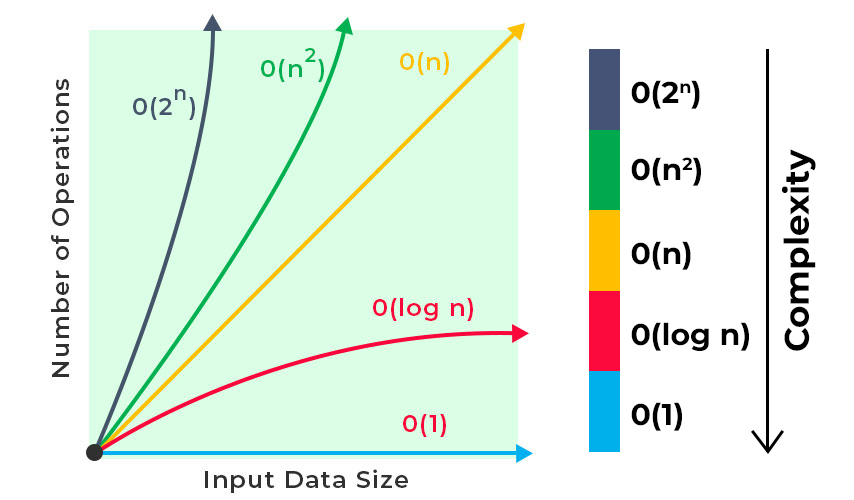
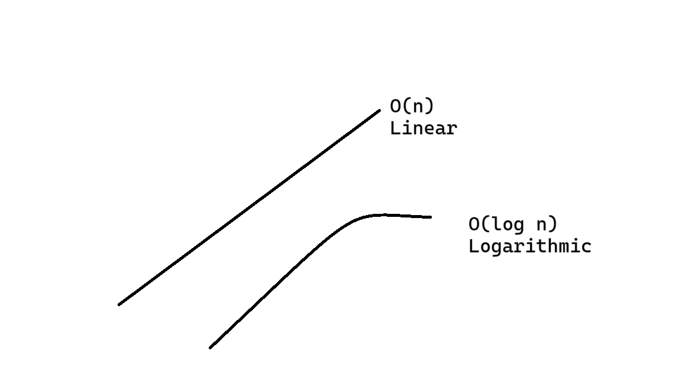

# Big O Notation

Big O Notation is a mathematical concept used in computer science to describe the performance or complexity of an algorithm. It provides an upper bound on the time or space an algorithm takes to complete as a function of the input size. This notation helps in comparing the efficiency of different algorithms and understanding how they scale with larger inputs.

## Common Big O Notations

- **O(1)**: Constant Time - The algorithm's performance is constant and does not change with the size of the input data. Example: Accessing an element in an array by index.
- **O(log n)**: Logarithmic Time - The algorithm's performance grows logarithmically as the input size increases. Example: Binary search in a sorted array.
- **O(n)**: Linear Time - The algorithm's performance grows linearly with the input size. Example: A simple loop through an array.
- **O(n log n)**: Linearithmic Time - The algorithm's performance grows in a combination of linear and logarithmic time. Example: Efficient sorting algorithms like mergesort and heapsort.
- **O(n^2)**: Quadratic Time - The algorithm's performance grows quadratically  with the input size. Example: Simple sorting algorithms like bubble sort and insertion sort.
- **O(2^n)**: Exponential Time - The algorithm's performance doubles with each additional element in the input data set. Example: Recursive algorithms that solve problems like the traveling salesman problem.
- **O(n!)**: Factorial Time - The algorithm's performance grows factorially with the input size. Example: Algorithms that generate all permutations of a set.

### Visual Representation

